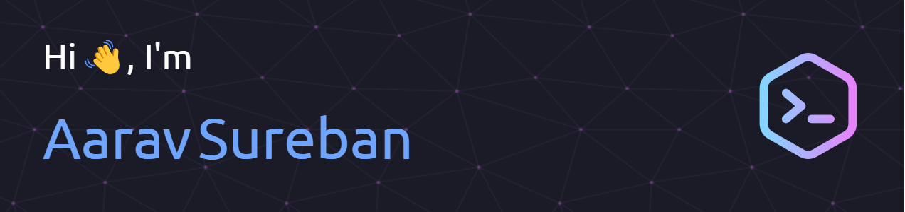

# 💫 About Me:
📖 Computer Engineering student at the University of Illinois Urbana-Champaign 🔭 Currently working on my personal portfolio website 🌱 Currently learning PostgreSQL & Spring Boot  ⭐ Hobbies: guitar, working out, and rollercoasters

# 💻 Languages:
           

# 🛠️ Tools and Frameworks:
                                   

# 🌐 Socials:
  

# 

  
  

