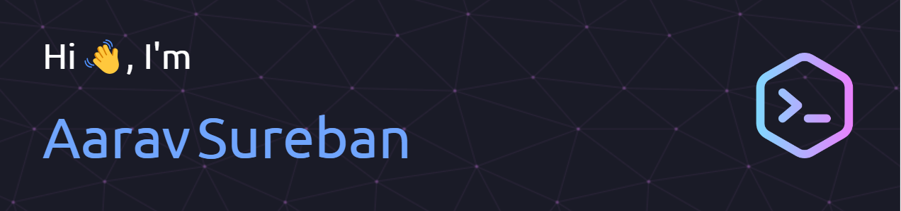

# 💫 About Me:
📖 Computer Engineering student at the University of Illinois Urbana-Champaign 🔭 Currently working on my personal portfolio website 🌱 Currently learning reinforcement learning  ⭐ Hobbies: rating movies, playing guitar, and going on rollercoasters

# 💻 Languages

# 🤖 Robotics & Embedded Systems

# 🧠 AI, Machine Learning & Computer Vision

# ⚙️ Software Engineering & Infrastructure

# 🌐 Socials:
  

# 

  
  

